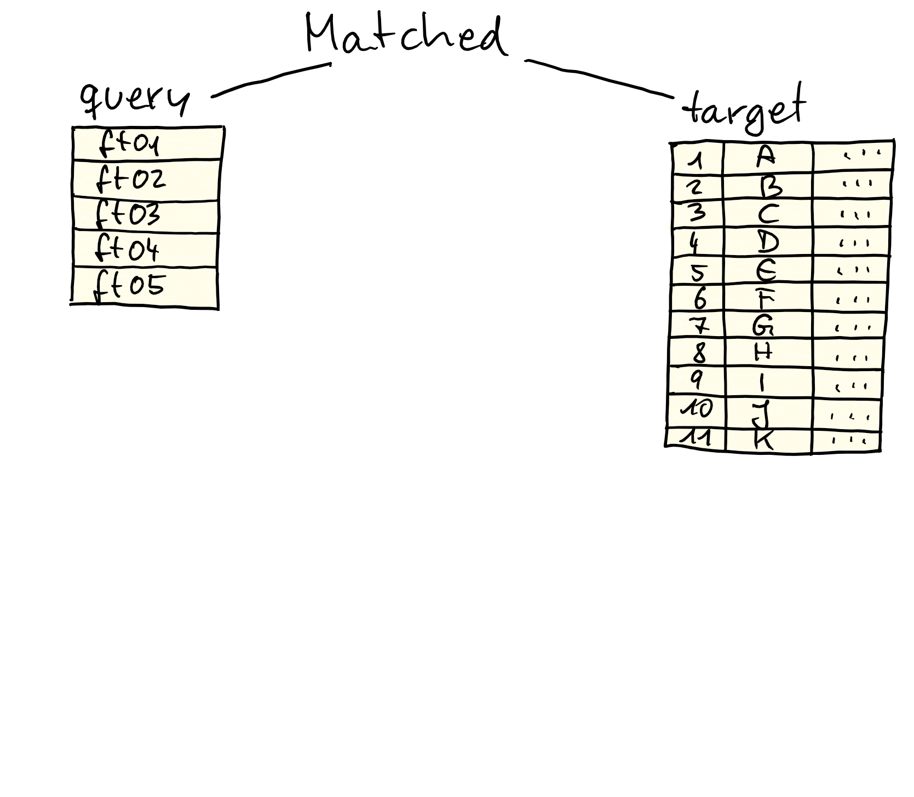
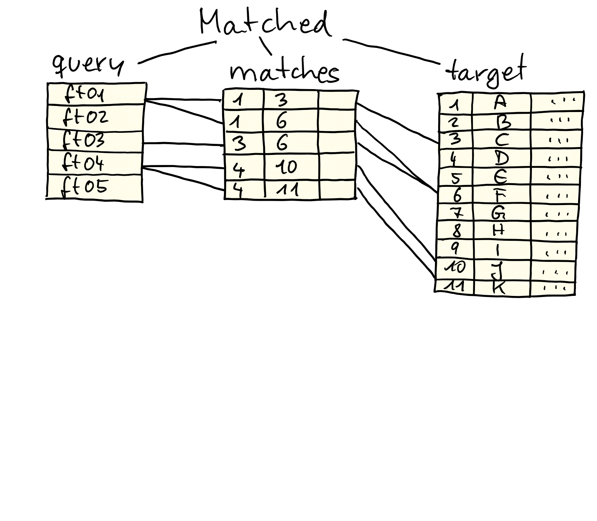
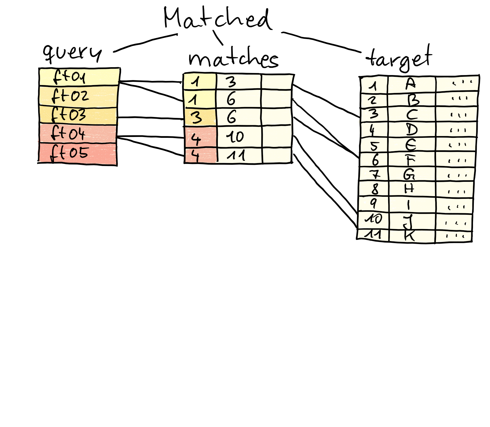
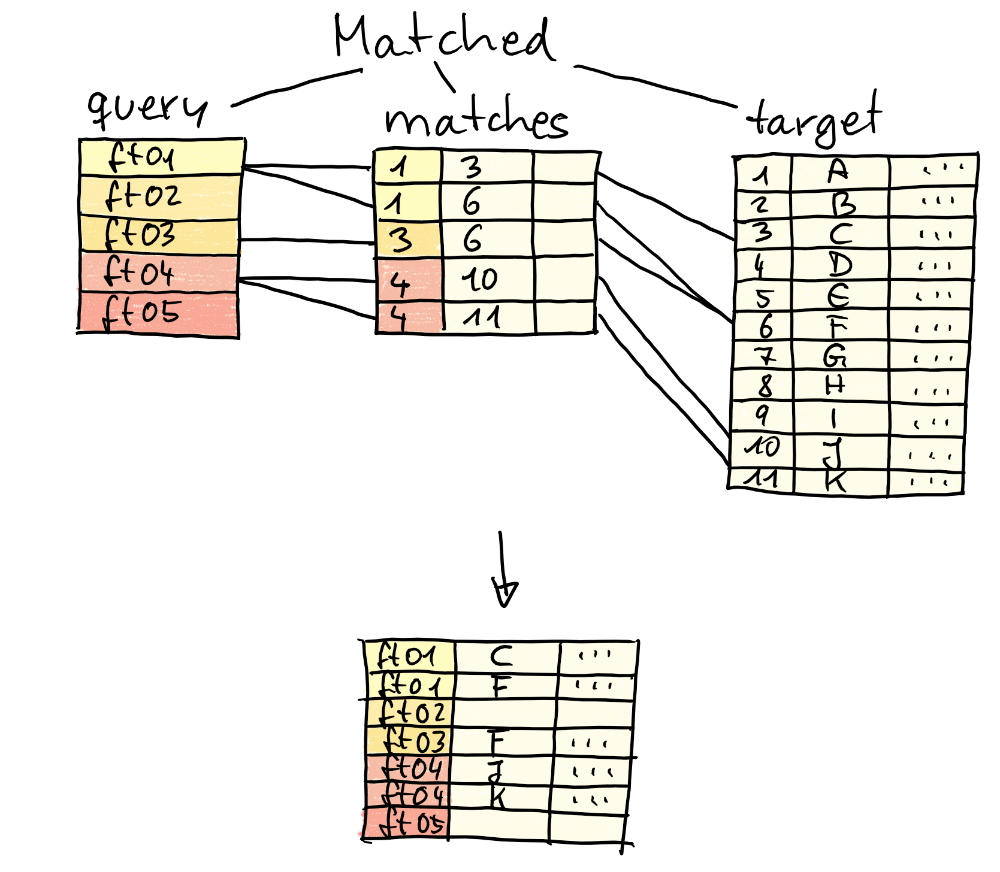

<style type="text/css">

slides > slide:not(.nobackground):after {
  content: '';
}

slides > slide {
    -webkit-transition:none !important;transition:none !important;
}

.build > * {
  -webkit-transition: opacity 0.1s ease-in-out;
  -webkit-transition-delay: 0.1s;
  -moz-transition: opacity 0.1s ease-in-out 0.1s;
  -o-transition: opacity 0.1s ease-in-out 0.1s;
  transition: opacity 0.1s ease-in-out 0.1s;
}

</style>

<!--
Export to pdf:
webshot function from webshot package.
Might have to change stuff in the style sheet to make it working.
library(webshot)
install_phantomjs()
rmdshot("Spectra.Rmd", "Spectra.pdf")
-->

## 

```{r out.width = "300px", echo = FALSE}
knitr::include_graphics("images/MetaboAnnotation.png")
```

- *Simplify* annotation process and handling of matched results.
- `matchMz` and `matchSpectra` functions.
- Matching configured with specific `Param` object.
- [Tutorial](https://jorainer.github.io/SpectraTutorials/articles/Spectra-matching-with-MetaboAnnotation.html).


## `matchMz` {.smaller}

- Annotation using mass or m/z and/or retention time.
- `matchMz(query, target, param)`
- `query`: features to annotate. Can be `numeric`, `data.frame` or
  `SummarizedExperiment`.
- `target`: annotations, can be `numeric`, `data.frame`, `CompDb` (not yet).
- `param`: 
  - `MzParam`: match query and target m/z values.
  - `MzRtParam`: same as above with additional retention times.
  - `Mass2MzParam`: target provides exact masses. m/z for (specified) adducts
    are calculated and matched.
  - `Mass2MzRtParam`: same as above with additional retention times.
  - ... suggest your own ...


## The result

- `Matched` object: contains `query`, `target` and parameter (reproducibility).

<div>
```{r out.width = "500px", echo = FALSE}

```
</div>


## The result

- `Matched` object: contains `query`, `target` and parameter (reproducibility).

<div>
```{r out.width = "500px", echo = FALSE}

```
</div>

## The result

- `Matched` object: contains `query`, `target` and parameter (reproducibility).

<div>
```{r out.width = "500px", echo = FALSE}

```
</div>

## The result

- `Matched` object: contains `query`, `target` and parameter (reproducibility).

<div>
```{r out.width = "500px", echo = FALSE}

```
</div>

## The result

- `Matched` object: contains `query`, `target` and parameter (reproducibility).

<div>
```{r out.width = "500px", echo = FALSE}

```
</div>


## `matchSpectra` {.smaller}

- Match query MS2 spectra against reference.
- `matchSpectra(query, target, param)`
- `query`: `Spectra`.
- `target`: `Spectra` (e.g. representing *MassBank* data).
- `param`:
  - `CompareSpectraParam`: match spectra with score above threshold. Pre-filter
    by precursor m/z or presence of certain peak.
  - `MatchForwardReverseParam`: same as above, but calculates also the reverse
    score.
  - ... suggest your own ...


## Outlook/TODOs

- Integration of `CompDb` (and `IonDb` = + retention times) databases for
  `matchMz`.
- Additional spectra similarity calculation methods? GNPS?
- Improve handling of `Matched` and `MatchedSpectra` objects?


## Example {.smaller}

- The query.

```{r, message = FALSE}
library(MetaboAnnotation)
ms1_features <- read.table(system.file("extdata", "MS1_example.txt",
                                       package = "MetaboAnnotation"),
                           header = TRUE, sep = "\t")
head(ms1_features)
```


## Example {.smaller}

- The target data.

```{r}
target_df <- read.table(system.file("extdata", "LipidMaps_CompDB.txt",
                                    package = "MetaboAnnotation"),
                        header = TRUE, sep = "\t")
head(target_df)
```

## Example {.smaller}

```{r}
parm <- Mass2MzParam(adducts = c("[M+H]+", "[M+Na]+"),
                           tolerance = 0.005, ppm = 0)

matched_features <- matchMz(ms1_features, target_df, parm)
matched_features
```


## Example {.smaller}

- `whichQuery`, `whichTarget` to get the indices of matched elements.
- `colnames` to return the available columns names.

```{r}
colnames(matched_features)
```

- Prefix `"target_"` is used for column names of the *target*.

## Example {.smaller}

- Extract *matched* elements.

```{r}
matchedData(matched_features, c("feature_id", "adduct", "target_name"))
```

## Example {.smaller}

- Reduce the *target* to only matching elements.

```{r}
matched_features
matched_features <- pruneTarget(matched_features)
matched_features
```

## Example {.smaller}

- Reduce the *query* to contain only matching elements.

```{r}
matched_features
matched_features <- matched_features[whichQuery(matched_features)]
matched_features
```

